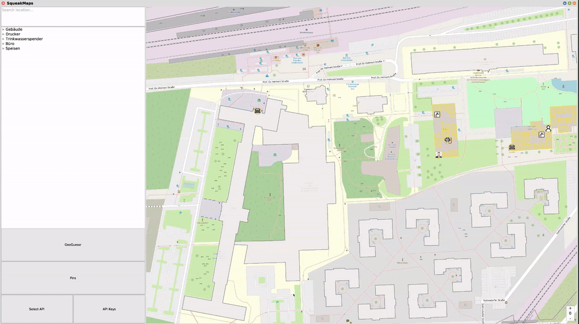
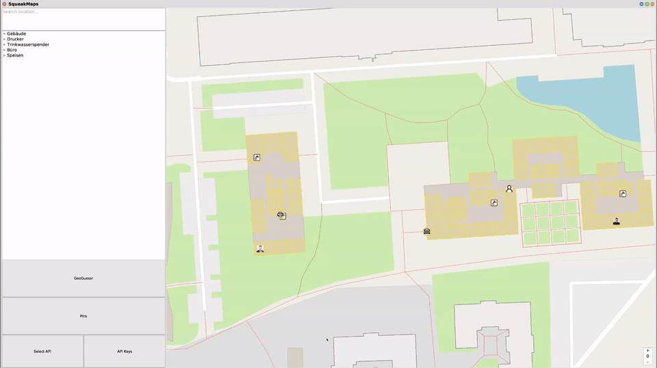

# CampusExplorer and CampusGuesser
[![Forks][forks-shield]][forks-url]
[![Stargazers][stars-shield]][stars-url]
[![Issues][issues-shield]][issues-url]
[![MIT License][license-shield]][license-url]
[![CI][ci-shield]][ci-url]

## About The Project

![Campus_Explorer_CampusGuesser][img-dir]


_CampusExplorer and CampusGuesser_ is a [Squeak][squeak-url]-based tool developed for people new at our **HPI campus** by the [SqueakMaps dev team SWT26-G06](#Team). It is built on top of the legacy [SqueakMaps][legacy-url] project by SWT22-12 and SWT20-11, which provides the foundational map infrastructure including satellite imagery, street maps from [OpenStreetMaps][osm-url], [Bing][bing-maps-url] and [Thunderforest][thunderforest-url], and routing via [OpenRouteService][ors-url].

The current development effort adds HPI-specific functionality on top of that foundation. **Scope is intentionally limited to the development of features**; not exhaustive cataloguing of the entire campus.

### Features

- **Buildings & Rooms** -> HPI buildings drawn as polygons with room-level detail at higher zoom; floor selection via global floor variable; accessibility-aware color palette
- **GeoGuesser** -> HPI campus edition (Campus 1, 2, 3); timer, pin-based guesses, scoring by time and accuracy; multiplayer via pass-and-play (no network server required)


- **Find Nearest** -> locate nearest room, person, or point of interest
- **Opening Hours** -> rooms, persons, and facilities
- **Mensa Widget** -> canteen information embedded in the map view
- **Routing** -> routes calculated via [OpenRouteService][ors-url]



> **Focus area:** Haus K for building/room mapping; ABC building for POIs (e.g. Studiref). Campus 1, 2, 3 for GeoGuesser.

### Prerequisites

Be sure to have the following installed:

* [Squeak 5.3 or later](squeak-url)
* [Metacello](metacello-url)
* [Morphic Testing Framework](mtf-url) (for development)

Older versions of [Squeak](squeak-url) won't work due to a bug.

### Installation

```smalltalk
Metacello new
  baseline: 'SqueakMaps';
  repository: 'github://hpi-swa-teaching/SqueakMaps/packages';
  load.
```

Then make sure to checkout our groups [main branchswt26-g06/main](https://github.com/hpi-swa-teaching/SqueakMaps/tree/swt26-g06/main).

## Usage

To open up a new window in your image simply go to _Apps > Squeak Maps_, or run the following command inside a **Workspace**:

```smalltalk
SMAApplication open.
```

**In order to use _Bing_, _Thunderforest_ and _OpenRouteServices_ you have to aquire your own API-keys either from [Bing-Maps][bing-maps-url], [Thunderforest][thunderforest-url] or [OpenRouteServices][ors-url]. [OpenStreetMaps](osm_url) can be used without a key.**

When using an API for the first time a window will popup requesting the corresponding key. After that your key will be saved. You can change these using the `manage api keys` button.

## Contributing

See [CONTRIBUTING.md](CONTRIBUTING.md) for branch naming, commit conventions, PR rules, and rebase setup.

Browser Categories of interest:

* SqueakMaps-Core
* SqueakMaps-Tests
* SqueakMaps-TiledMaps
* SqueakMaps-GeoServices
* (BaselineOfSqueakMaps)

## Roadmap

Feature freeze: **29.06.2026** — bug fixes only after that date.

Check out our [Roadmap][project-url] and [Issues][issues-url].

## License

Distributed under the MIT License. See [LICENSE][license-url] for more information.

## Acknowledgements

Legacy project originally by [Tony Garnock-Jones][tony-jones-url], extended by SWT22-12 and SWT20-11 (see [legacy project][legacy-url]).

Special thanks to [Theresa (phoeinx)](https://github.com/phoeinx), [Patrick R (codeZeilen)](https://github.com/codeZeilen) and [Paula (Paula-Kli)](https://github.com/Paula-Kli) for the support.

## Team

SWT26-G06:
* [KerenPi](https://github.com/KerenPi)
* [alexzanco](https://github.com/alexzanco)
* [Helena2006](https://github.com/Helena2006)
* [DanielC04](https://github.com/DanielC04)
* [JostClausen](https://github.com/JostClausen)
* [samuelbiasgit](https://github.com/samuelbiasgit)
* [kong-35](https://github.com/kong-35)

<details>
<summary>Legacy teams</summary>

SWT22-12:
* [TimRiedel](https://github.com/TimRiedel)
* [Durborough](https://github.com/Durborough)
* [richartkeil](https://github.com/richartkeil)
* [Glitterrosie](https://github.com/glitterrosie)
* [JanniRoebbecke](https://github.com/JanniRoebbecke)
* [LeoKohlenberg](https://github.com/LeoKohlenberg)

SWT20-11:
* [RichSchulz](https://github.com/RichSchulz)
* [Dale (C-8)](https://github.com/C-8)
* [MartenMIK](https://github.com/MartenMIK)
* [Schirmchens](https://github.com/Schirmchens)
* [BennytheBomb](https://github.com/BennytheBomb)

</details>

## Google Sheets

https://docs.google.com/spreadsheets/d/1H8KeyrBITCSXGmxg7X0JzUf-dQI6P_TVylMv7TXxXSM/edit?gid=0#gid=0


[img-dir]: img/CampusExplorer_CampusGuesser_GUI.png
[squeak-url]: https://squeak.org
[bing-maps-url]: https://www.bing.com/maps
[osm-url]: https://www.openstreetmap.org
[ors-url]: https://openrouteservice.org
[thunderforest-url]: https://www.thunderforest.com
[metacello-url]: https://github.com/Metacello/metacello
[ci-shield]: https://github.com/hpi-swa-teaching/SqueakMaps/workflows/CI/badge.svg?branch=dev
[ci-url]: https://github.com/hpi-swa-teaching/SqueakMaps/actions
[mtf-url]: https://github.com/hpi-swa-teaching/Morphic-Testing-Framework
[tiledmaps-url]: http://www.squeaksource.com/TiledMaps.html
[tony-jones-url]: http://www.squeaksource.com/@ieeBQfgrendEEft9/oZWC2ZTV?13
[legacy-url]: https://github.com/hpi-swa-teaching/SqueakMaps
[project-url]: https://github.com/orgs/hpi-swa-teaching/projects/75
[issues-url]: https://github.com/hpi-swa-teaching/SqueakMaps/issues
[issues-shield]: https://img.shields.io/github/issues/hpi-swa-teaching/SqueakMaps
[forks-shield]: https://img.shields.io/github/forks/hpi-swa-teaching/SqueakMaps
[forks-url]: https://github.com/hpi-swa-teaching/SqueakMaps/network/members
[stars-shield]: https://img.shields.io/github/stars/hpi-swa-teaching/SqueakMaps
[stars-url]: https://github.com/hpi-swa-teaching/SqueakMaps/stargazers
[license-shield]: https://img.shields.io/github/license/hpi-swa-teaching/SqueakMaps
[license-url]: LICENSE
